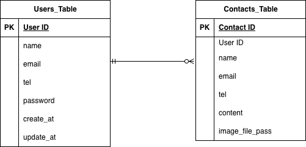

# first-contact

# 環境構築

## Dockerビルド

 ・ git clone <git@github.com>:haruki-saitou/first-contact.git  
 ・ docker-compose up -d --build

## Laravel環境構築

 ・ docker-compose exec php bash  
 ・ composer install  
 ・ cp .env.exemple. .env , 環境変数を適宣変更  
 ・ php artisan key:generate  
 ・ php artisan migrate  
 ・ php artisan db:seed  

## 開発環境

 ・ お問合せ画面 : <http://localhost/>  
 ・ ユーザー登録 : <http://localhost/register>  
 ・ ログイン : <http://localhost/login>  
 ・ お問合せ内容確認 : <http://localhost/contacts/confirm>  
 ・ 送信完了画面 : <http://localhost/complete>  
 ・ 送信履歴 : <http://localhost/contact/history>  
 ・ phpMyAdmin : <http://localhost:8080/>  

## 使用技術(実行環境)

・ PHP 8.1.33  
・ MySQL 8.0  
・ nginx 1.21.1  
・ laravel : 8.83.8  

## ER図

  

#### users Table (User Authentication Information)

| Column Name | Data Type | Key/Constraints | Description |
| :--- | :--- | :--- | :--- |
| **id** | BIGINT | Primary Key | User ID |
| name | VARCHAR | | User Name |
| email | VARCHAR | UNIQUE | Email Address (Login ID) |
| password | VARCHAR | | Password (Hashed) |
| email_verified_at | TIMESTAMP | Nullable | Email Verification Timestamp |
| remember_token | VARCHAR | | Login Persistence Token |
| created_at/updated_at | TIMESTAMP | | Record Creation/Update Timestamps |

#### contacts Table (Contact Form Submissions)

| Column Name | Data Type | Key/Constraints | Description |
| :--- | :--- | :--- | :--- |
| **id** | BIGINT | Primary Key | Contact ID |
| name | VARCHAR | | Submitter's Name |
| email | VARCHAR | | Submitter's Email |
| tel | VARCHAR | Length 11 | Phone Number |
| content | TEXT | Nullable | Submission Content/Message |
| created_at/updated_at | TIMESTAMP | | Record Creation/Update Timestamps |
